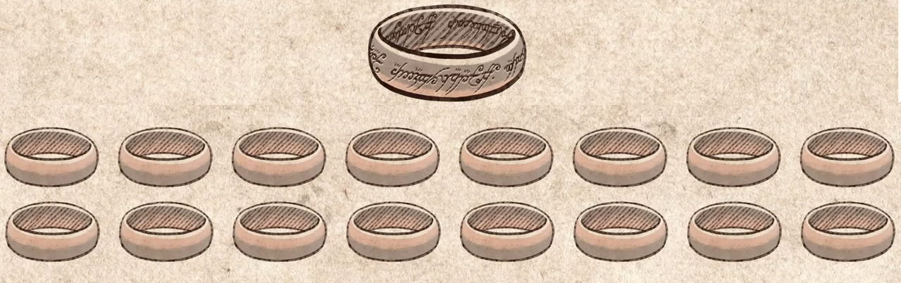
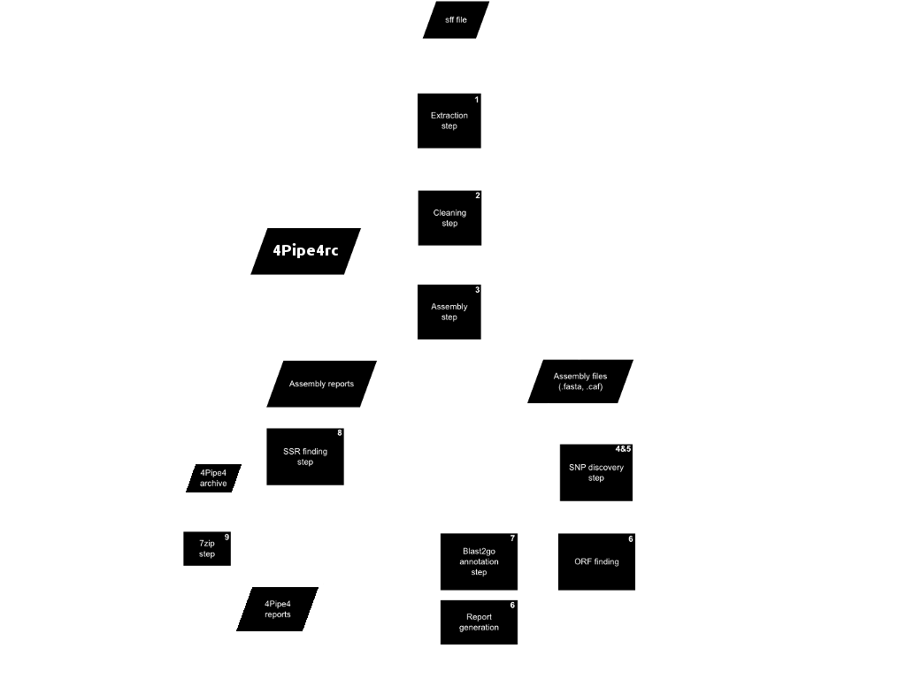

#Adventures of a PhD

##Developing software to tackle evolutionary biology problems – performance, automation and reproducibility.

###Francisco Pina-Martins ([@FPinaMartins](https://twitter.com/FPinaMartins))
####Octávio S. Paulo
#####[https://stuntspt.github.io/BODs2016_presentation](https://stuntspt.github.io/BODs2016_presentation)

.fx: titleslide transparentheading imageslide

---

#The PhD

* "Analyses of the genomic variation to study cork oak evolution and adaptation: from past to future climatic changes."

---

#The PhD

* "Analyses of the genomic variation to study cork oak evolution and adaptation: from past to future climatic changes."

* Evolutionary biology of *Quercus suber*

---

#The PhD

* "Analyses of the genomic variation to study cork oak evolution and adaptation: from past to future climatic changes."

* Evolutionary biology of *Quercus suber*
* Heavy bioinformatics component

---

#Biological results

* One day I will give a talk about them

---

#Biological results

* One day I will give a talk about them

---

#Biological results

* One day I will give a talk about them

* Performance

---

#Biological results

* One day I will give a talk about them

* Performance
* Automation

---

#Biological results

* One day I will give a talk about them

* Performance
* Automation
* Reproducibility

---

#Performance

* Doing the same thing, but faster

---

#Performance

* Doing the same thing, but faster
* It gains relevance as data grows bigger

---

#Performance

* Doing the same thing, but faster
* It gains relevance as data grows bigger
    * STRUCTURE ?

---

#Performance

* Doing the same thing, but faster
* It gains relevance as data grows bigger
    * STRUCTURE ?

---

#Some tips on increasing it

* Code optimization

---

#Some tips on increasing it

* Code optimization
    * Replace *for loops* with *list comprehensions*

---

#Some tips on increasing it

* Code optimization
    * Replace *for loops* with *list comprehensions*
    * Replace *lists* with *generators*

---

#Some tips on increasing it

* Code optimization
    * Replace *for loops* with *list comprehensions*
    * Replace *lists* with *generators*
    * Use fast data structures (eg. *sets* instead of *lists*)

---

#Some tips on increasing it

* Code optimization
    * Replace *for loops* with *list comprehensions*
    * Replace *lists* with *generators*
    * Use fast data structures (eg. *sets* instead of *lists*)
* Profile your code

---

#Some tips on increasing it

* Code optimization
    * Replace *for loops* with *list comprehensions*
    * Replace *lists* with *generators*
    * Use fast data structures (eg. *sets* instead of *lists*)
* Profile your code
    * Times program components

---

#Some tips on increasing it

* Code optimization
    * Replace *for loops* with *list comprehensions*
    * Replace *lists* with *generators*
    * Use fast data structures (eg. *sets* instead of *lists*)
* Profile your code
    * Times program components
    * "[profiling](https://github.com/what-studio/profiling)" is my favourite python profiler

---

#Real life example

[4Pipe4](https://github.com/StuntsPT/4Pipe4) - 64Mb and 3.2Gb files (52h run)

---

#Real life example

[4Pipe4](https://github.com/StuntsPT/4Pipe4) - 64Mb and 3.2Gb files (52h run)

    !python
    def Indexer(reference, list):
        indeces = []
        for lines in list:
            if lines in reference:
                indeces.append(reference.index(call))
        return indeces

---

#Real life example

[4Pipe4](https://github.com/StuntsPT/4Pipe4) - 64Mb and 3.2Gb files (52h run)

    !python
    def Indexer(reference, list):
        indeces = []
        for lines in list:
            if lines in reference:
                indeces.append(reference.index(call))
        return indeces

15% performance increase:

    !python
    def Indexer(reference, list):
        names = tuple(filter(lambda x: x in ref, list))
        indeces = tuple(map(ref.index,names))
        return indeces

---

#Real life example

    !python
    def indexer(reference, list):
        list_set = set(list)
        matches = [i for i, j in enumerate(ref) if j in list_set]
        return matches

---

#Real life example

    !python
    def indexer(reference, list):
        list_set = set(list)
        matches = [i for i, j in enumerate(ref) if j in list_set]
        return matches

Run time went down to **6 minutes**!

[The whole story](http://ubuntuforums.org/showthread.php?t=1642792) is online.

---

#Performance

* Threading!

---

#Performance

* Threading!
    * Huge speed benefits

---

#Performance

* Threading!
    * Huge speed benefits
    * Generates more complex code

---

#Performance

* Threading!
    * Huge speed benefits
    * Generates more complex code
    * Not all tasks can be threaded

---

#Performance

* Threading!
    * Huge speed benefits
    * Generates more complex code
    * Not all tasks can be threaded

---

#Structure_threader

* Increases performance by parallelizing [STRUCTURE](http://pritchardlab.stanford.edu/structure.html)

.fx: github 

---

#Structure_threader

* Increases performance by parallelizing [STRUCTURE](http://pritchardlab.stanford.edu/structure.html)
* Also works with the alternative [fastStructure](https://rajanil.github.io/fastStructure/)

.fx: github 

---

#Structure_threader

---

#Structure_threader

* Increases performance by parallelizing [STRUCTURE](http://pritchardlab.stanford.edu/structure.html)
* Also works with the alternative [fastStructure](https://rajanil.github.io/fastStructure/)
* **Automates** the entire analysis process

.fx: github 

---

#Automation
 
* Getting stuff done without human intervention

---

#Automation
 
* Getting stuff done without human intervention
* Eliminates (arguably) random error

---

#Automation
 
* Getting stuff done without human intervention
* Eliminates (arguably) random error
* Has to be very well tested (and flexible!)

---

#Automation
 
* Getting stuff done without human intervention
* Eliminates (arguably) random error
* Has to be very well tested (and flexible!)
    * Otherwise increases systematic error

---

#Automation

* Takes a lot of work to be "Done Right"TM

---

#Automation

* Takes a lot of work to be "Done Right"TM

---

#Automation

* Takes a lot of work to be "Done Right"TM

* Has to connect and integrate multiple tasks

---

#Automation

* Takes a lot of work to be "Done Right"TM

* Has to connect and integrate multiple tasks
* Inevitably reduces the flexibility of tools

---

#4Pipe4

* A NGS data analysis pipeline

.fx: github

---

#4Pipe4

.fx: imageslide

---

#4Pipe4

.fx: imageslide

---

#4Pipe4

.fx: imageslide

---

#4Pipe4

.fx: imageslide

---

#Reproducibility

* Re-doing an analysis and obtaining the same result

---

#Reproducibility

* Re-doing an analysis and obtaining the same result
* Central to science in general

---

#Reproducibility

* Re-doing an analysis and obtaining the same result
* Central to science in general
* Special relevance in bioinformatics

---

#Reproducibility

* Re-doing an analysis and obtaining the same result
* Central to science in general
* Special relevance in bioinformatics
    * Repeating computational analysis is easier than repeating wet-lab procedures

---

#Reproducibility

* Re-doing an analysis and obtaining the same result
* Central to science in general
* Special relevance in bioinformatics
    * Repeating computational analysis is easier than repeating wet-lab procedures
    * Volatile

---

#Reproducibility

* Config files for pipelines

---

#Reproducibility

* Config files for pipelines
    * "Contained" install environment

---

#Reproducibility

* Config files for pipelines
    * "Contained" install environment
* Use a VCS
    * Make a run and commit the results

---

#Reproducibility

* Config files for pipelines
    * "Contained" install environment
* Use a VCS
    * Make a run and commit the results
* Keep track of dependency versions

---

#Reproducibility

* Config files for pipelines
    * "Contained" install environment
* Use a VCS
    * Make a run and commit the results
* Keep track of dependency versions
* Ideally use something like [jupyter](http://jupyter.org/)

---

#Reproducibility

* Config files for pipelines
    * "Contained" install environment
* Use a VCS
    * Make a run and commit the results
* Keep track of dependency versions
* Ideally use something like [jupyter](http://jupyter.org/)
* Open source your code!

---

#Reproducibility examples

"PyRAD 3.03 was used with default parameters."

---

#Reproducibility examples

"PyRAD 3.03 was used with default parameters."

"PyRAD 3.03 was used with default parameters (Vsearch 1.19, Muscle 3.8.31, numpy 1.10.4, etc...)."

---

#Reproducibility examples

"PyRAD 3.03 was used with default parameters."

"PyRAD 3.03 was used with default parameters (Vsearch 1.19, Muscle 3.8.31, numpy 1.10.4, etc...)."

[PyRAD procedure using jupyter](http://nbviewer.jupyter.org/gist/dereneaton/af9548ea0e94bff99aa0/pyRAD_v.3.0.ipynb#2.-Installation)

---

#Putting it all together

* How can we combine all these traits?

---

#Putting it all together

* How can we combine all these traits?

---

#Containers

* [LXC](https://linuxcontainers.org/lxc/introduction/) - Basics
* [LXD](https://linuxcontainers.org/lxd/introduction/) - Secure LXC + tools 

---

#Containers

* [LXC](https://linuxcontainers.org/lxc/introduction/) - Basics
* [LXD](https://linuxcontainers.org/lxd/introduction/) - Secure LXC + tools 

* [rkt]() - Most secure, still very experimental optimized for *CoreOS*

---

#Containers

* [LXC](https://linuxcontainers.org/lxc/introduction/) - Basics
* [LXD](https://linuxcontainers.org/lxd/introduction/) - Secure LXC + tools 

* [rkt]() - Most secure, still very experimental optimized for *CoreOS*

* [Docker](http://www.docker.com/) - Most popular

---

#Containers

* Are halfway between a VM and a *chroot*

---

#Containers

* Are halfway between a VM and a *chroot*
    * No multiple OSes

---

#Containers

* Are halfway between a VM and a *chroot*
    * No multiple OSes
    * Use the host system hardware directly

---

#Containers

* Are halfway between a VM and a *chroot*
    * No multiple OSes
    * Use the host system hardware directly
* Provide an isolated GNU/Linux environment

---

#Containers

* Are halfway between a VM and a *chroot*
    * No multiple OSes
    * Use the host system hardware directly
* Provide an isolated GNU/Linux environment

---

#Containers

* Are halfway between a VM and a *chroot*
    * No multiple OSes
    * Use the host system hardware directly
* Provide an isolated GNU/Linux environment

---

#Containers

* Are halfway between a VM and a *chroot*
    * No multiple OSes
    * Use the host system hardware directly
* Provide an isolated GNU/Linux environment

---

#Containers

* Automation

---

#Containers

* Automation
    * No human intervention

---

#Containers

* Automation
    * No human intervention
* Reproducibility

---

#Containers

* Automation
    * No human intervention
* Reproducibility
    * Running the same container & data == same results

---

#Containers

* Automation
    * No human intervention
* Reproducibility
    * Running the same container & data == same results
* Performance

---

#Containers

* Automation
    * No human intervention
* Reproducibility
    * Running the same container & data == same results
* Performance
    * Small, lightweight system

---

#Containers

* Automation
    * No human intervention
* Reproducibility
    * Running the same container & data == same results
* Performance
    * Small, lightweight system
    * No VM overhead

---

#Containers

##Cool projects

* [Bioboxes](http://bioboxes.org/)

---

#Containers

##Cool projects

* [Bioboxes](http://bioboxes.org/)

* [nucleotid.es](http://nucleotid.es)

---

#Containers

##What's the drawback?

---

#Containers

##What's the drawback?

* Relatively large files for distribution

---

#Containers

##What's the drawback?

* Relatively large files for distribution
* Not 100% secure

---

#Containers

##What's the drawback?

* Relatively large files for distribution
* Not 100% secure
* Encourage "Black box" like approaches

---

#Wrap up

* What did this mean for me and the cork oak?

---

#Wrap up

* What did this mean for me and the cork oak?
    * Performance - more responsiveness

---

#Wrap up

* What did this mean for me and the cork oak?
    * Performance - more responsiveness
    * Automation - time savings, avoid repetitive tasks

---

#Wrap up

* What did this mean for me and the cork oak?
    * Performance - more responsiveness
    * Automation - time savings, avoid repetitive tasks
    * Reproducibility - scientific value, easy re-runs

